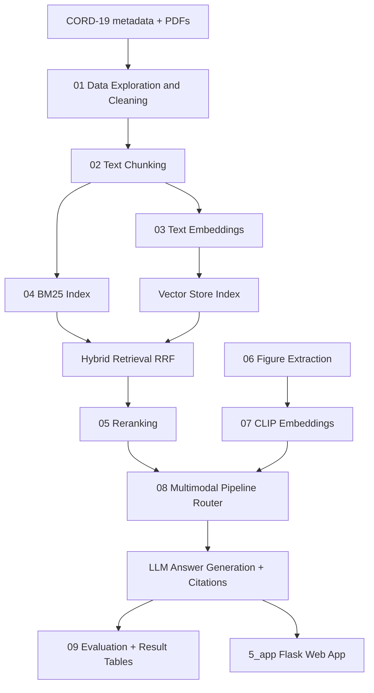

# SciRet System Design Guide (Beginner-Friendly)

This document explains how SciRet differs from a classic ML/DL project and how to run it efficiently across Tier 1 (1k papers) and Tier 2 (50k papers).

---

## 1) How SciRet is different from regular ML/DL

## Classic ML/DL (what you did in Legacy SciRet style)

Typical flow:

1. Data analysis
2. Clean data / feature engineering
3. Choose model
4. Train model
5. Save model weights
6. Deploy model for prediction

Key property: **knowledge is stored in model weights** after training.

---

## RAG system (SciRet)

Typical flow:

1. Ingest corpus (papers)
2. Clean and chunk documents
3. Create embeddings and indexes
4. Retrieve relevant chunks at query time
5. (Optional) rerank chunks
6. Generate answer grounded in retrieved evidence

Key property: **knowledge is stored mostly in external data/indexes**, not in fine-tuned model weights.

So, SciRet is closer to an **information system + search pipeline + LLM reasoning layer** than a pure train-once prediction model.

---

## Why this matters for system design

- In classic ML, deployment artifact is mostly `model.pt` / `model.pkl`.
- In RAG, deployment artifact is usually:
  - preprocessing/chunking logic
  - embedding model identifier/version
  - vector index (e.g., ChromaDB)
  - sparse index (BM25), if hybrid
  - metadata mapping files
  - prompt + generation settings

If any of these mismatches, results can become inconsistent.

---

## 2) End-to-end SciRet architecture diagram

---

## 3) Why your embedding step reruns and how to fix it

You noticed notebook cell 16 (embedding) takes about 2 hours. This happens because notebook memory is reset when kernel restarts, so in-memory variables like `embeddings` disappear.

## Correct pattern for future projects: "compute once, persist always"

After computing embeddings, immediately save them to disk:

- Save vectors (`.npy`, `.parquet`, or in vector DB)
- Save matching IDs (`chunk_id`)
- Save metadata (model name, chunk config, data version)

Then, on next run:

1. Check if cached embedding files exist
2. If yes, load from disk (skip recomputation)
3. If no, compute and save

This is called a **cache-or-build** pipeline.

## Practical persistence options

- **Option A (simple):** `numpy.save()` / `numpy.load()` + `chunks.parquet`
- **Option B (best for retrieval):** write directly to persistent Chroma collection once, reuse it later
- **Option C (large scale):** shard embeddings into multiple parquet/npy files

## Cache safety checklist

- Keep the same embedding model name and version
- Keep same chunking parameters (chunk size/overlap)
- Keep same preprocessing pipeline
- Keep same ID generation logic (`chunk_id`)

If any of the above changes, regenerate embeddings.

---

## 4) Your 1k vs 50k confusion (cross-machine portability)

Short answer: **yes, it can work**, if artifacts are consistent.

If you compute 50k embeddings on Kaggle and copy them to your local machine, it works when:

- local code uses the same embedding model
- the local retrieval code expects the same vector dimension
- chunk IDs and metadata schema match
- index files are copied completely (not partially)

Important: 1k embeddings and 50k embeddings are different indexes. You should treat them as two separate environments:

- `tier1_index` for development
- `tier2_index` for paper experiments

Do not mix them in one collection name.

---

## 5) Suggested artifact layout by tier

Use separate folders or collection names so you never accidentally query the wrong index.

Example:

- `1_data/processed/tier1/`
- `1_data/processed/tier2/`
- `1_data/embeddings/tier1/`
- `1_data/embeddings/tier2/`
- Chroma collection names:
  - `sciret_tier1_bge_m3_cs400_o50`
  - `sciret_tier2_bge_m3_cs400_o50`

This naming gives instant reproducibility.

---

## 6) Kaggle single-notebook concern

You are right that Kaggle workflows often end up in one notebook. But you can still preserve your modular design:

1. Keep reusable logic in `2_src/` Python modules.
2. In Kaggle notebook, import those modules and run sections in order.
3. Treat Kaggle notebook as an orchestration script, not where all core logic lives.

So your local and Kaggle code can remain the same; only path/config/tier changes.

---

## 7) Recommended execution strategy for your setup

For your hardware constraints, use this approach:

1. Build and debug all logic in Tier 1 locally.
2. Freeze config (model, chunk params, retrieval params, seeds).
3. Run Tier 2 on Kaggle with exact same code and frozen config.
4. Export Tier 2 artifacts (indexes/results) to cloud storage.
5. Pull only needed artifacts to local for analysis/demo (not necessarily all raw data).

This is exactly a strong research-engineering workflow and is suitable for paper writing.

---

## 8) One-line mental model

Classic ML = "train model to remember knowledge."  
SciRet RAG = "store knowledge in searchable memory, then fetch + reason at runtime."

